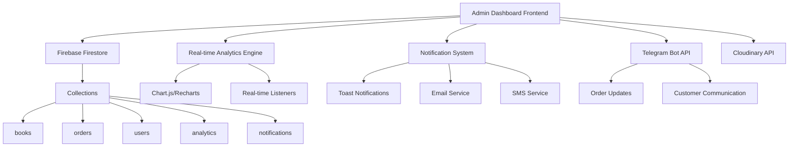

# Enhanced Admin Dashboard Design Document

## Overview

Enhanced Admin Dashboard - Zamon Books loyihasining admin panelini professional darajaga ko'tarish uchun mo'ljallangan comprehensive dashboard tizimi. Bu dizayn real-time analytics, advanced order management, CRM, inventory tracking va business intelligence imkoniyatlarini birlashtiradi.

## Architecture

### High-Level Architecture



### Component Architecture

```
src/components/admin/enhanced/
├── Dashboard/
│   ├── DashboardOverview.jsx
│   ├── RealTimeStats.jsx
│   ├── QuickActions.jsx
│   └── RecentActivity.jsx
├── Analytics/
│   ├── SalesAnalytics.jsx
│   ├── CustomerAnalytics.jsx
│   ├── InventoryAnalytics.jsx
│   └── PerformanceMetrics.jsx
├── OrderManagement/
│   ├── OrdersTable.jsx
│   ├── OrderDetails.jsx
│   ├── OrderStatusManager.jsx
│   └── BulkOrderActions.jsx
├── CRM/
│   ├── CustomerList.jsx
│   ├── CustomerProfile.jsx
│   ├── CustomerCommunication.jsx
│   └── CustomerSegmentation.jsx
├── Inventory/
│   ├── StockOverview.jsx
│   ├── StockAlerts.jsx
│   ├── BulkStockUpdate.jsx
│   └── InventoryReports.jsx
├── Communication/
│   ├── NotificationCenter.jsx
│   ├── TelegramIntegration.jsx
│   ├── MessageTemplates.jsx
│   └── CommunicationHistory.jsx
└── SystemMonitoring/
    ├── SystemHealth.jsx
    ├── ErrorLogs.jsx
    ├── PerformanceMonitor.jsx
    └── ServiceStatus.jsx
```

## Components and Interfaces

### 1. Dashboard Overview Component

**Purpose:** Main dashboard landing page with key metrics and quick actions

**Props Interface:**
```typescript
interface DashboardOverviewProps {
  dateRange: DateRange;
  refreshInterval: number;
  userRole: 'admin' | 'superadmin';
}

interface DashboardStats {
  todayOrders: number;
  todayRevenue: number;
  activeUsers: number;
  lowStockItems: number;
  pendingOrders: number;
  systemHealth: 'healthy' | 'warning' | 'critical';
}
```

**Key Features:**
- Real-time statistics cards
- Interactive charts (sales, orders, customers)
- Quick action buttons
- Recent activity feed
- System status indicators

### 2. Real-Time Analytics Engine

**Purpose:** Handles all real-time data processing and chart generation

**Service Interface:**
```typescript
class AnalyticsService {
  // Real-time listeners
  subscribeToOrderUpdates(callback: (data: OrderStats) => void): () => void;
  subscribeToSalesUpdates(callback: (data: SalesStats) => void): () => void;
  subscribeToInventoryUpdates(callback: (data: InventoryStats) => void): () => void;
  
  // Data aggregation
  async getSalesAnalytics(dateRange: DateRange): Promise<SalesAnalytics>;
  async getCustomerAnalytics(dateRange: DateRange): Promise<CustomerAnalytics>;
  async getInventoryAnalytics(): Promise<InventoryAnalytics>;
  
  // Report generation
  async generateSalesReport(options: ReportOptions): Promise<ReportData>;
  async exportAnalytics(format: 'pdf' | 'excel', data: any): Promise<Blob>;
}
```

### 3. Advanced Order Management

**Purpose:** Comprehensive order processing and management system

**Component Structure:**
```typescript
interface OrderManagementProps {
  filters: OrderFilters;
  sortBy: OrderSortOptions;
  pagination: PaginationOptions;
}

interface OrderFilters {
  status: OrderStatus[];
  dateRange: DateRange;
  customerType: CustomerType[];
  paymentStatus: PaymentStatus[];
  searchQuery: string;
}

interface OrderActions {
  updateStatus: (orderId: string, status: OrderStatus) => Promise<void>;
  sendNotification: (orderId: string, message: string) => Promise<void>;
  processRefund: (orderId: string, amount: number) => Promise<void>;
  bulkUpdateStatus: (orderIds: string[], status: OrderStatus) => Promise<void>;
}
```

### 4. Customer Relationship Management

**Purpose:** Complete customer data management and communication

**CRM Interface:**
```typescript
interface CustomerProfile {
  id: string;
  personalInfo: PersonalInfo;
  orderHistory: Order[];
  communicationHistory: Communication[];
  preferences: CustomerPreferences;
  segmentation: CustomerSegment;
  lifetime_value: number;
  last_activity: Date;
}

interface CRMActions {
  getCustomerProfile: (customerId: string) => Promise<CustomerProfile>;
  updateCustomerNotes: (customerId: string, notes: string) => Promise<void>;
  sendPersonalizedMessage: (customerId: string, message: string) => Promise<void>;
  segmentCustomers: (criteria: SegmentationCriteria) => Promise<CustomerSegment[]>;
}
```

### 5. Inventory Management System

**Purpose:** Advanced stock tracking and management

**Inventory Interface:**
```typescript
interface InventoryItem {
  bookId: string;
  currentStock: number;
  minStockLevel: number;
  maxStockLevel: number;
  reorderPoint: number;
  stockStatus: StockStatus;
  lastRestocked: Date;
  averageSalesPerDay: number;
  estimatedStockoutDate: Date;
}

interface InventoryActions {
  updateStock: (bookId: string, quantity: number, operation: 'add' | 'subtract' | 'set') => Promise<void>;
  setStockAlerts: (bookId: string, minLevel: number) => Promise<void>;
  generateStockReport: (options: ReportOptions) => Promise<StockReport>;
  bulkStockUpdate: (updates: StockUpdate[]) => Promise<void>;
}
```

### 6. Real-time Messaging System

**Purpose:** User-Admin communication platform with real-time messaging

**Messaging Architecture:**
```typescript
interface Conversation {
  id: string;
  participants: {
    userId: string;
    adminId: string;
    userInfo: {
      name: string;
      email: string;
      phone?: string;
      telegramUsername?: string;
    };
  };
  lastMessage: Message;
  unreadCount: {
    user: number;
    admin: number;
  };
  status: 'active' | 'closed' | 'archived';
  createdAt: Date;
  updatedAt: Date;
}

interface Message {
  id: string;
  conversationId: string;
  senderId: string;
  senderType: 'user' | 'admin';
  content: string;
  messageType: 'text' | 'image' | 'file' | 'system';
  attachments?: MessageAttachment[];
  isRead: boolean;
  readAt?: Date;
  createdAt: Date;
}

interface MessagingService {
  // Conversation management
  createConversation: (userId: string, adminId: string) => Promise<Conversation>;
  getConversations: (adminId: string, filters?: ConversationFilters) => Promise<Conversation[]>;
  getConversation: (conversationId: string) => Promise<Conversation>;
  
  // Message operations
  sendMessage: (conversationId: string, senderId: string, content: string) => Promise<Message>;
  getMessages: (conversationId: string, pagination?: Pagination) => Promise<Message[]>;
  markAsRead: (conversationId: string, userId: string) => Promise<void>;
  
  // Real-time subscriptions
  subscribeToConversations: (adminId: string, callback: (conversations: Conversation[]) => void) => () => void;
  subscribeToMessages: (conversationId: string, callback: (messages: Message[]) => void) => () => void;
  
  // Notifications
  sendNotification: (conversationId: string, message: Message) => Promise<void>;
}
```

**Component Structure:**
```
src/components/messaging/
├── UserChat/
│   ├── ChatWidget.jsx          # Floating chat button
│   ├── ChatWindow.jsx          # User chat interface
│   ├── MessageInput.jsx        # Message input component
│   └── MessageBubble.jsx       # Individual message display
├── AdminMessaging/
│   ├── ConversationList.jsx    # List of all conversations
│   ├── ConversationView.jsx    # Individual conversation view
│   ├── MessageThread.jsx       # Message thread display
│   ├── QuickResponses.jsx      # Pre-defined quick responses
│   └── CustomerInfo.jsx        # Customer info sidebar
└── Shared/
    ├── MessageStatus.jsx       # Read/unread indicators
    ├── TypingIndicator.jsx     # Typing status
    ├── FileUpload.jsx          # File attachment handler
    └── EmojiPicker.jsx         # Emoji selection
```

## Data Models

### 1. Enhanced Analytics Collection

```typescript
interface AnalyticsDocument {
  id: string;
  date: Date;
  type: 'daily' | 'weekly' | 'monthly';
  metrics: {
    orders: {
      total: number;
      completed: number;
      cancelled: number;
      pending: number;
      revenue: number;
    };
    customers: {
      new: number;
      returning: number;
      active: number;
    };
    inventory: {
      totalItems: number;
      lowStockItems: number;
      outOfStockItems: number;
    };
    performance: {
      avgOrderValue: number;
      conversionRate: number;
      customerSatisfaction: number;
    };
  };
  createdAt: Date;
  updatedAt: Date;
}
```

### 2. Enhanced Order Model

```typescript
interface EnhancedOrder {
  id: string;
  // Existing fields
  userId: string;
  bookId: string;
  quantity: number;
  totalAmount: number;
  status: OrderStatus;
  
  // New enhanced fields
  priority: 'low' | 'medium' | 'high' | 'urgent';
  assignedAdmin: string;
  estimatedDelivery: Date;
  trackingNumber?: string;
  paymentMethod: 'cash' | 'card' | 'transfer' | 'other';
  paymentStatus: 'pending' | 'confirmed' | 'failed' | 'refunded';
  communicationHistory: Communication[];
  internalNotes: string;
  customerRating?: number;
  customerFeedback?: string;
  
  // Timestamps
  createdAt: Date;
  updatedAt: Date;
  confirmedAt?: Date;
  shippedAt?: Date;
  deliveredAt?: Date;
}
```

### 3. Customer Profile Model

```typescript
interface CustomerProfile {
  id: string;
  // Basic info
  fullName: string;
  email: string;
  phone: string;
  telegramUsername?: string;
  
  // Enhanced fields
  customerType: 'new' | 'regular' | 'vip' | 'inactive';
  registrationDate: Date;
  lastOrderDate?: Date;
  totalOrders: number;
  totalSpent: number;
  averageOrderValue: number;
  
  // Preferences
  preferredGenres: string[];
  preferredAuthors: string[];
  communicationPreferences: {
    email: boolean;
    sms: boolean;
    telegram: boolean;
  };
  
  // Segmentation
  segment: CustomerSegment;
  loyaltyPoints: number;
  
  // Admin notes
  internalNotes: string;
  tags: string[];
  
  // Timestamps
  createdAt: Date;
  updatedAt: Date;
  lastActivity: Date;
}
```

### 4. Notification System Model

```typescript
interface AdminNotification {
  id: string;
  type: 'order' | 'stock' | 'system' | 'customer' | 'error' | 'message';
  priority: 'low' | 'medium' | 'high' | 'critical';
  title: string;
  message: string;
  data: any; // Additional context data
  
  // Status
  isRead: boolean;
  isArchived: boolean;
  
  // Actions
  actionRequired: boolean;
  actionUrl?: string;
  actionLabel?: string;
  
  // Recipients
  recipients: string[]; // Admin user IDs
  
  // Timestamps
  createdAt: Date;
  readAt?: Date;
  archivedAt?: Date;
}
```

### 5. Messaging System Models

```typescript
interface ConversationDocument {
  id: string;
  participants: {
    userId: string;
    adminId: string;
    userInfo: {
      name: string;
      email: string;
      phone?: string;
      telegramUsername?: string;
      avatar?: string;
    };
    adminInfo: {
      name: string;
      email: string;
      role: string;
    };
  };
  
  // Conversation metadata
  subject?: string;
  tags: string[];
  priority: 'low' | 'medium' | 'high' | 'urgent';
  status: 'active' | 'waiting' | 'closed' | 'archived';
  
  // Message tracking
  messageCount: number;
  lastMessage: {
    content: string;
    senderId: string;
    senderType: 'user' | 'admin';
    timestamp: Date;
  };
  
  // Read status
  unreadCount: {
    user: number;
    admin: number;
  };
  lastReadBy: {
    user?: Date;
    admin?: Date;
  };
  
  // Timestamps
  createdAt: Date;
  updatedAt: Date;
  closedAt?: Date;
}

interface MessageDocument {
  id: string;
  conversationId: string;
  
  // Sender info
  senderId: string;
  senderType: 'user' | 'admin';
  senderName: string;
  
  // Message content
  content: string;
  messageType: 'text' | 'image' | 'file' | 'system' | 'order_reference';
  
  // Attachments
  attachments: {
    type: 'image' | 'file';
    url: string;
    name: string;
    size: number;
  }[];
  
  // References (for order-related messages)
  references?: {
    type: 'order' | 'book' | 'user';
    id: string;
    title: string;
  };
  
  // Status
  isRead: boolean;
  readAt?: Date;
  isEdited: boolean;
  editedAt?: Date;
  
  // Timestamps
  createdAt: Date;
  updatedAt: Date;
}

interface QuickResponseTemplate {
  id: string;
  title: string;
  content: string;
  category: 'greeting' | 'order' | 'support' | 'closing';
  isActive: boolean;
  usageCount: number;
  createdBy: string;
  createdAt: Date;
}
```

## Error Handling

### 1. Global Error Boundary

```typescript
interface AdminErrorBoundary {
  // Error categories
  handleFirebaseError: (error: FirebaseError) => void;
  handleNetworkError: (error: NetworkError) => void;
  handleValidationError: (error: ValidationError) => void;
  handlePermissionError: (error: PermissionError) => void;
  
  // Error reporting
  reportError: (error: Error, context: ErrorContext) => void;
  
  // Recovery actions
  retryOperation: (operation: () => Promise<any>) => Promise<any>;
  fallbackToCache: (key: string) => any;
}
```

### 2. Error Logging Service

```typescript
interface ErrorLoggingService {
  logError: (error: Error, context: ErrorContext) => Promise<void>;
  getErrorLogs: (filters: ErrorFilters) => Promise<ErrorLog[]>;
  getErrorStats: (dateRange: DateRange) => Promise<ErrorStats>;
  clearOldLogs: (olderThan: Date) => Promise<void>;
}
```

## Testing Strategy

### 1. Unit Testing

**Components to Test:**
- All dashboard components
- Analytics calculations
- Data transformation functions
- Utility functions

**Testing Framework:**
- Jest + React Testing Library
- Firebase emulator for database tests
- Mock services for external APIs

### 2. Integration Testing

**Test Scenarios:**
- Real-time data updates
- Order status workflows
- Notification delivery
- Report generation
- Bulk operations

### 3. Performance Testing

**Metrics to Monitor:**
- Dashboard load time
- Real-time update latency
- Large dataset rendering
- Memory usage
- Bundle size impact

### 4. User Acceptance Testing

**Test Cases:**
- Admin workflow scenarios
- Error handling scenarios
- Mobile responsiveness
- Accessibility compliance

## Implementation Phases

### Phase 1: Core Dashboard (Week 1-2)
- Dashboard overview component
- Basic real-time statistics
- Navigation structure
- Theme integration

### Phase 2: Analytics Engine (Week 2-3)
- Real-time listeners setup
- Chart components integration
- Data aggregation services
- Basic reporting

### Phase 3: Order Management (Week 3-4)
- Enhanced order table
- Status management
- Bulk operations
- Communication integration

### Phase 4: CRM System (Week 4-5)
- Customer profiles
- Communication history
- Segmentation logic
- Customer analytics

### Phase 5: Advanced Features (Week 5-6)
- Inventory management
- System monitoring
- Notification center
- SEO tools

### Phase 6: Testing & Optimization (Week 6-7)
- Comprehensive testing
- Performance optimization
- Bug fixes
- Documentation

## Security Considerations

### 1. Access Control
- Role-based permissions
- Route protection
- API endpoint security
- Data access restrictions

### 2. Data Protection
- Input validation
- XSS prevention
- CSRF protection
- Secure data transmission

### 3. Audit Logging
- Admin action logging
- Data change tracking
- Access attempt logging
- Security event monitoring

## Performance Optimization

### 1. Code Splitting
- Lazy load dashboard sections
- Dynamic imports for heavy components
- Route-based splitting

### 2. Data Optimization
- Efficient Firebase queries
- Data caching strategies
- Pagination implementation
- Real-time listener optimization

### 3. UI Optimization
- Virtual scrolling for large lists
- Debounced search inputs
- Optimized re-renders
- Image lazy loading

## Deployment Strategy

### 1. Environment Setup
- Development environment
- Staging environment
- Production deployment
- Environment variables

### 2. CI/CD Pipeline
- Automated testing
- Build optimization
- Deployment automation
- Rollback procedures

### 3. Monitoring
- Error tracking
- Performance monitoring
- User analytics
- System health checks