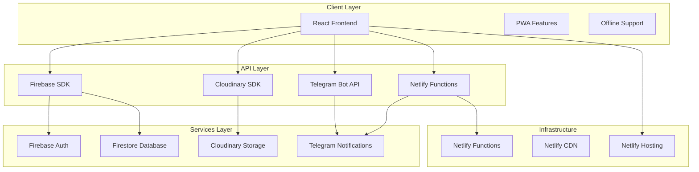
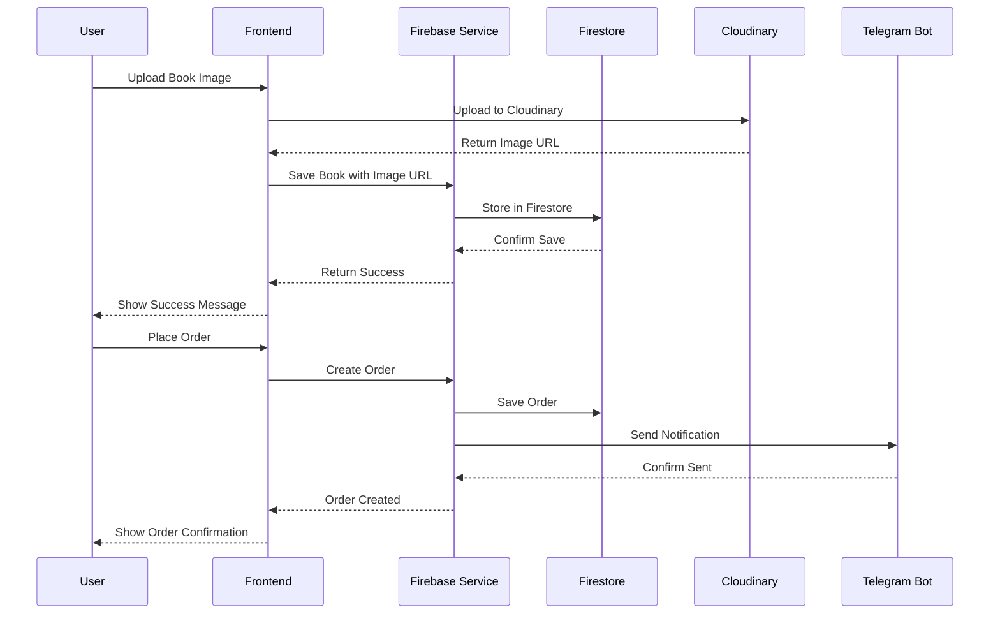
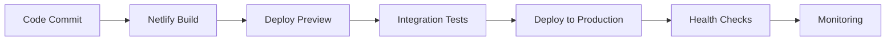

# Design Document

## Overview

Bu design hujjati Zamon Books e-commerce platformasini to'liq tugallash uchun zarur bo'lgan barcha komponentlar va integratsiyalarni belgilaydi. Asosiy maqsad - mavjud Firebase asosidagi loyihani production-ready holatga keltirish, Cloudinary rasm yuklash tizimini integratsiya qilish va barcha zarur funksionalliklarni to'liq ishlaydigan qilish.

Loyiha hozirda React + Vite + Firebase stack'ida qurilgan va quyidagi asosiy komponentlarga ega:
- Frontend: React 19.1.0 + React Router DOM
- Backend: Firebase (Firestore, Auth, Storage)
- Hosting: Netlify + Firebase Hosting
- Rasm saqlash: Cloudinary integratsiyasi kerak

## Architecture

### System Architecture



### Data Flow Architecture



## Components and Interfaces

### 1. Cloudinary Integration Service

**Purpose:** Rasm yuklash va boshqarish uchun Cloudinary bilan integratsiya

**Interface:**
```javascript
class CloudinaryService {
  // Rasm yuklash
  async uploadImage(file, options = {})
  
  // Rasm URL optimizatsiya
  getOptimizedUrl(publicId, transformations = {})
  
  // Rasm o'chirish
  async deleteImage(publicId)
  
  // Bulk rasm yuklash
  async uploadMultipleImages(files, options = {})
}
```

**Key Features:**
- Automatic image optimization
- Multiple format support (JPEG, PNG, WebP)
- Responsive image delivery
- Upload progress tracking
- Error handling va retry logic

### 2. Enhanced Firebase Service

**Purpose:** Mavjud FirebaseService'ni kengaytirish va optimizatsiya qilish

**New Methods:**
```javascript
class EnhancedFirebaseService extends FirebaseService {
  // Cloudinary URL bilan kitob yaratish
  async createBookWithImage(bookData, imageUrl)
  
  // Batch operations
  async batchUpdateBooks(updates)
  
  // Advanced search with filters
  async advancedSearch(query, filters)
  
  // Analytics data
  async getAnalyticsData(dateRange)
  
  // Inventory management
  async updateInventory(bookId, stockChange)
}
```

### 3. Telegram Notification Service

**Purpose:** Buyurtma va tizim hodisalari uchun Telegram orqali bildirishnomalar

**Interface:**
```javascript
class TelegramService {
  // Admin'ga yangi buyurtma haqida xabar
  async notifyNewOrder(orderData)
  
  // Foydalanuvchiga buyurtma holati haqida xabar
  async notifyOrderStatus(userId, orderData, status)
  
  // Stok tugashi haqida ogohlantirish
  async notifyLowStock(bookData)
  
  // Bulk xabarlar yuborish
  async sendBulkNotifications(users, message)
}
```

### 4. Enhanced Admin Panel Components

**Purpose:** Admin panel funksionallarini kengaytirish

**New Components:**
- `ImageUploadManager` - Cloudinary orqali rasm yuklash
- `InventoryDashboard` - Stok boshqaruvi
- `OrderManagementEnhanced` - Kengaytirilgan buyurtma boshqaruvi
- `AnalyticsDashboard` - Sotuv va foydalanuvchi statistikasi
- `NotificationCenter` - Telegram xabarlar boshqaruvi

### 5. User Experience Enhancements

**Purpose:** Foydalanuvchi tajribasini yaxshilash

**Components:**
- `AdvancedSearch` - Kengaytirilgan qidiruv filtrlari
- `WishlistManager` - Sevimlilar ro'yxati boshqaruvi
- `OrderTracking` - Buyurtma kuzatuvi
- `UserNotifications` - Foydalanuvchi bildirish nomalari
- `ProductRecommendations` - Mahsulot tavsiyalari

## Data Models

### Enhanced Book Model

```javascript
const BookModel = {
  // Existing fields
  id: String,
  title: String,
  authorName: String,
  authorId: String,
  genreId: String,
  price: Number,
  description: String,
  isAvailable: Boolean,
  
  // Enhanced fields
  images: {
    main: String,        // Cloudinary URL
    gallery: [String],   // Additional images
    thumbnail: String    // Optimized thumbnail
  },
  
  inventory: {
    stock: Number,
    reserved: Number,    // Reserved for pending orders
    lowStockThreshold: Number,
    restockDate: Date
  },
  
  seo: {
    slug: String,
    metaTitle: String,
    metaDescription: String,
    keywords: [String]
  },
  
  analytics: {
    viewCount: Number,
    salesCount: Number,
    wishlistCount: Number,
    rating: Number,
    reviewCount: Number
  },
  
  // Timestamps
  createdAt: Timestamp,
  updatedAt: Timestamp,
  publishedAt: Timestamp
}
```

### Enhanced Order Model

```javascript
const OrderModel = {
  // Existing fields
  id: String,
  orderNumber: String,
  userId: String,
  items: [OrderItem],
  totalAmount: Number,
  status: String,
  
  // Enhanced fields
  customer: {
    name: String,
    email: String,
    phone: String,
    address: {
      street: String,
      city: String,
      region: String,
      postalCode: String
    }
  },
  
  payment: {
    method: String,      // 'cash', 'card', 'transfer'
    status: String,      // 'pending', 'paid', 'failed'
    transactionId: String,
    paidAt: Timestamp
  },
  
  shipping: {
    method: String,      // 'pickup', 'delivery', 'courier'
    cost: Number,
    trackingNumber: String,
    estimatedDelivery: Date,
    actualDelivery: Date
  },
  
  notifications: {
    adminNotified: Boolean,
    customerNotified: Boolean,
    telegramSent: Boolean
  },
  
  // Timestamps
  createdAt: Timestamp,
  updatedAt: Timestamp,
  confirmedAt: Timestamp,
  shippedAt: Timestamp,
  deliveredAt: Timestamp
}
```

### User Notification Model

```javascript
const NotificationModel = {
  id: String,
  userId: String,
  type: String,        // 'order', 'wishlist', 'promotion', 'system'
  title: String,
  message: String,
  data: Object,        // Additional data
  read: Boolean,
  priority: String,    // 'low', 'medium', 'high'
  createdAt: Timestamp,
  readAt: Timestamp
}
```

## Error Handling

### Error Categories

1. **Network Errors**
   - Firebase connection issues
   - Cloudinary upload failures
   - Telegram API errors

2. **Validation Errors**
   - Form input validation
   - File type/size validation
   - Business logic validation

3. **Authentication Errors**
   - Login failures
   - Permission denied
   - Session expiration

4. **System Errors**
   - Database constraints
   - Storage limits
   - Rate limiting

### Error Handling Strategy

```javascript
class ErrorHandler {
  static handle(error, context) {
    // Log error
    console.error(`Error in ${context}:`, error);
    
    // Categorize error
    const category = this.categorizeError(error);
    
    // Show user-friendly message
    const userMessage = this.getUserMessage(category, error);
    
    // Send to monitoring service (optional)
    this.reportError(error, context);
    
    return {
      category,
      userMessage,
      originalError: error
    };
  }
  
  static categorizeError(error) {
    if (error.code?.startsWith('auth/')) return 'authentication';
    if (error.code?.startsWith('storage/')) return 'storage';
    if (error.message?.includes('network')) return 'network';
    return 'system';
  }
  
  static getUserMessage(category, error) {
    const messages = {
      authentication: 'Tizimga kirish bilan bog\'liq muammo yuz berdi.',
      storage: 'Fayl yuklashda muammo yuz berdi.',
      network: 'Internet aloqasini tekshiring.',
      system: 'Tizimda vaqtincha muammo. Keyinroq urinib ko\'ring.'
    };
    
    return messages[category] || messages.system;
  }
}
```

## Testing Strategy

### Unit Testing

**Components to Test:**
- CloudinaryService methods
- Enhanced FirebaseService methods
- TelegramService functionality
- Form validation logic
- Error handling functions

**Testing Framework:** Jest + React Testing Library

### Integration Testing

**Scenarios to Test:**
- Complete order flow
- Image upload and display
- Telegram notification delivery
- Admin panel operations
- User authentication flow

### End-to-End Testing

**Critical User Journeys:**
1. User registration and login
2. Browse and search books
3. Add to cart and checkout
4. Admin book management
5. Order processing workflow

**Testing Tools:** Cypress or Playwright

### Performance Testing

**Metrics to Monitor:**
- Page load times
- Image loading performance
- Database query performance
- API response times
- Bundle size optimization

## Security Considerations

### Firebase Security Rules

```javascript
// Firestore Security Rules
rules_version = '2';
service cloud.firestore {
  match /databases/{database}/documents {
    // Books - public read, admin write
    match /books/{bookId} {
      allow read: if true;
      allow write: if isAdmin();
    }
    
    // Users - own data only
    match /users/{userId} {
      allow read, write: if request.auth != null && request.auth.uid == userId;
      allow read: if isAdmin();
    }
    
    // Orders - own orders or admin
    match /orders/{orderId} {
      allow read, write: if request.auth != null && 
        (resource.data.userId == request.auth.uid || isAdmin());
    }
    
    // Cart - own cart only
    match /cart/{cartId} {
      allow read, write: if request.auth != null && 
        resource.data.userId == request.auth.uid;
    }
    
    function isAdmin() {
      return request.auth != null && 
        get(/databases/$(database)/documents/users/$(request.auth.uid)).data.isAdmin == true;
    }
  }
}
```

### API Security

1. **Environment Variables Protection**
   - Sensitive keys in server-side only
   - Client-side keys properly scoped
   - Regular key rotation

2. **Input Validation**
   - Sanitize all user inputs
   - File upload restrictions
   - Rate limiting on APIs

3. **Authentication & Authorization**
   - JWT token validation
   - Role-based access control
   - Session management

## Performance Optimization

### Frontend Optimization

1. **Code Splitting**
   - Lazy loading components
   - Route-based splitting
   - Dynamic imports

2. **Image Optimization**
   - Cloudinary automatic optimization
   - WebP format support
   - Responsive images
   - Lazy loading

3. **Caching Strategy**
   - Service Worker caching
   - Browser caching headers
   - CDN caching

### Backend Optimization

1. **Database Optimization**
   - Proper indexing
   - Query optimization
   - Connection pooling

2. **API Optimization**
   - Response compression
   - Pagination
   - Batch operations

## Deployment Strategy

### Environment Setup

1. **Development Environment**
   - Local development server (Vite)
   - Test Cloudinary account
   - Development Telegram bot
   - Netlify Dev for local functions testing

2. **Staging Environment**
   - Netlify branch deploys
   - Staging Cloudinary folder
   - Test notifications
   - Preview URLs for testing

3. **Production Environment**
   - Netlify production deployment
   - Production Cloudinary account
   - Live Telegram notifications
   - Custom domain configuration

### Deployment Pipeline



### Rollback Strategy

1. **Database Rollback**
   - Firestore backup/restore
   - Migration scripts

2. **Code Rollback**
   - Netlify deploy rollback
   - Git revert and redeploy

3. **Asset Rollback**
   - Cloudinary version management
   - Netlify CDN cache invalidation

## Monitoring and Analytics

### Application Monitoring

1. **Error Tracking**
   - JavaScript error monitoring
   - API error tracking
   - User action logging

2. **Performance Monitoring**
   - Page load metrics
   - API response times
   - Database query performance

### Business Analytics

1. **User Analytics**
   - User behavior tracking
   - Conversion funnel analysis
   - Retention metrics

2. **Sales Analytics**
   - Revenue tracking
   - Product performance
   - Inventory analytics

### Alerting System

1. **Technical Alerts**
   - System errors
   - Performance degradation
   - Security incidents

2. **Business Alerts**
   - Low stock warnings
   - High-value orders
   - Unusual activity patterns